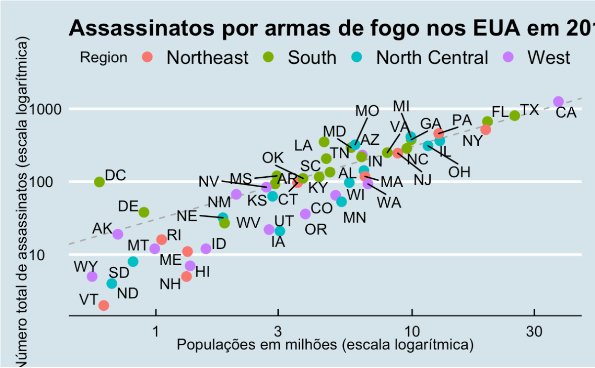
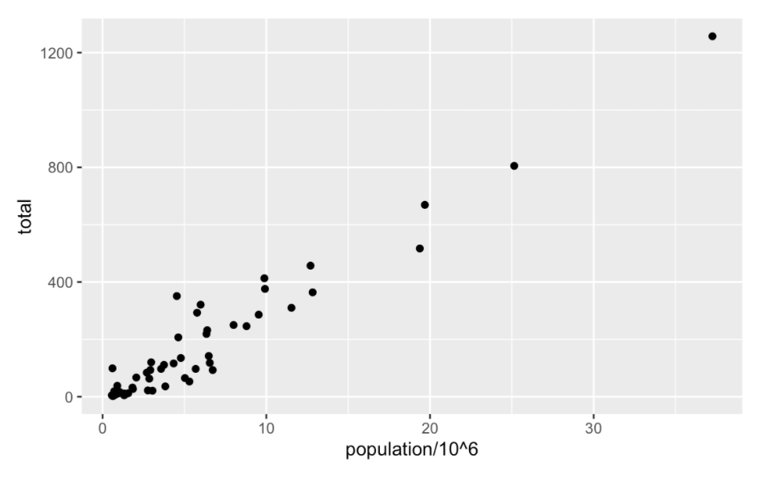
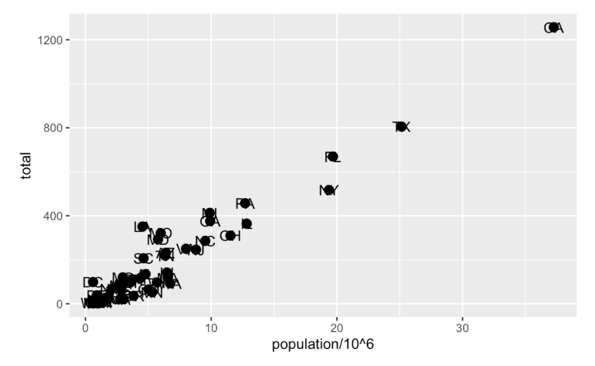
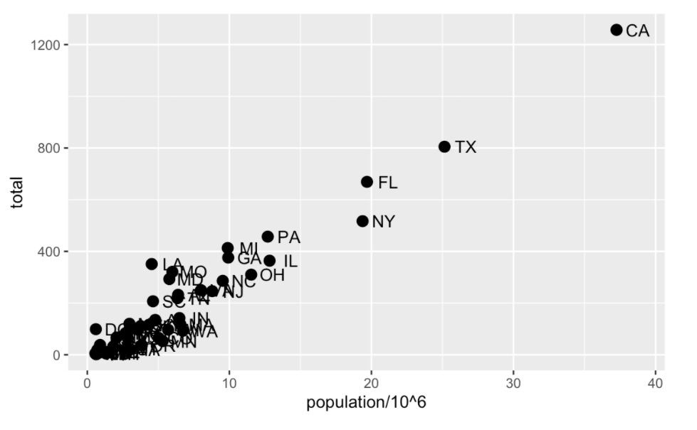
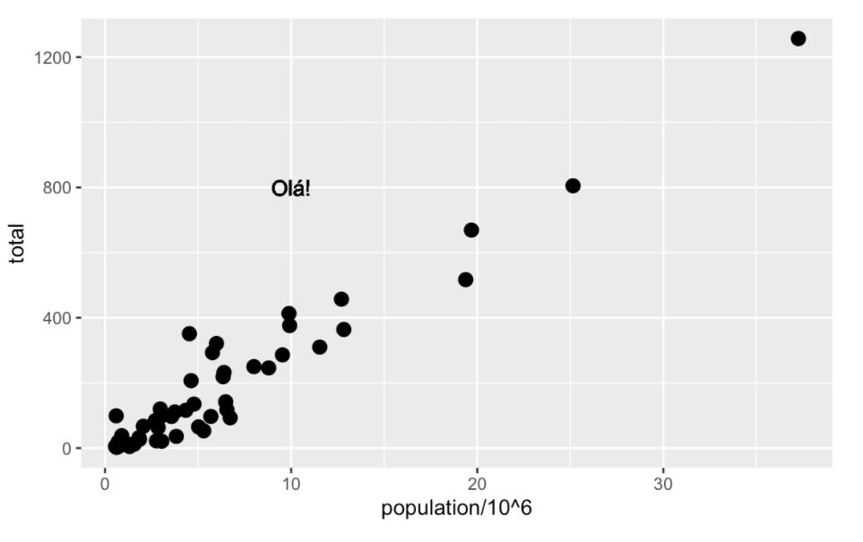
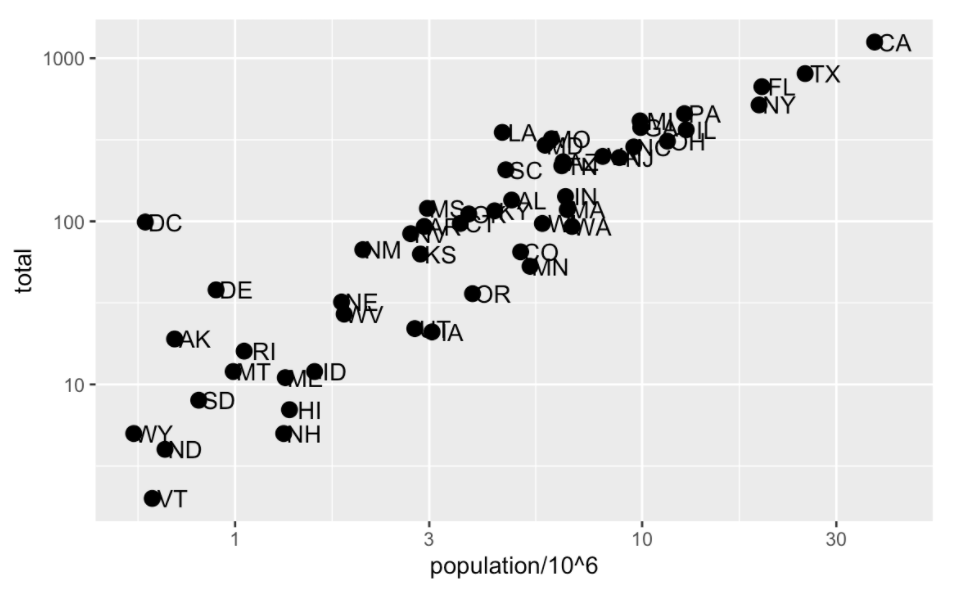
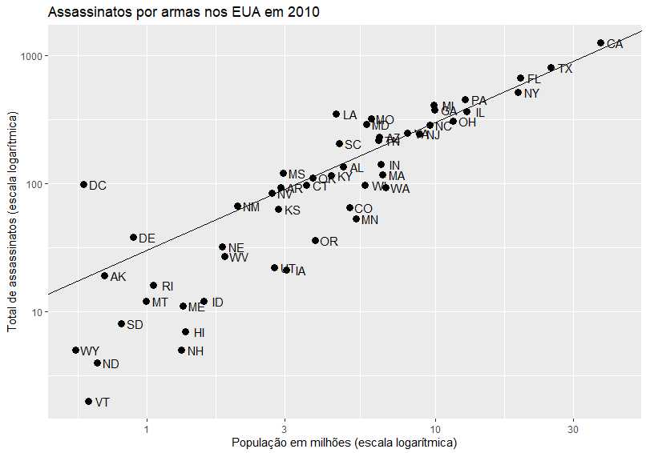
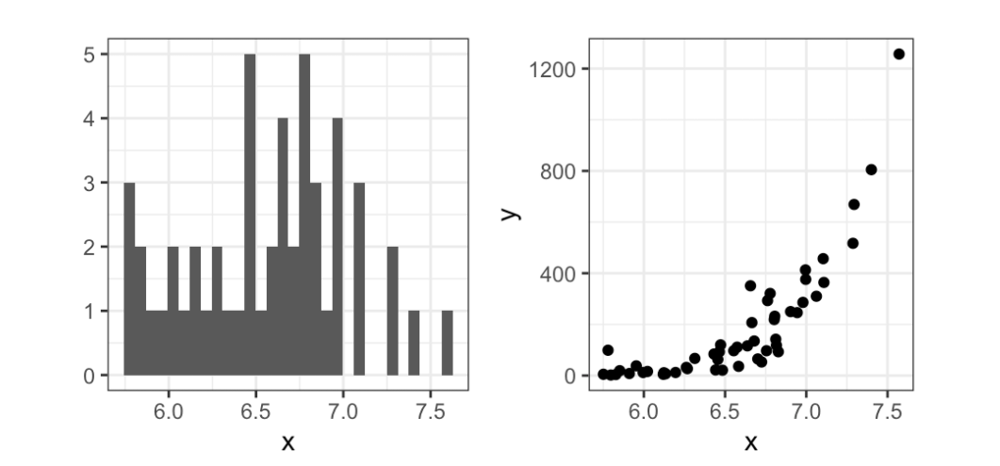

# ggplot2

A visualização de dados é talvez a maior vantagem do R, quando comparamos com o Excel conseguimos concluir que o Excel é mais fácil, mas o R é mais flexível.

O pacote **ggplot2** tem como finalidade ajudar na criação de gráficos usando o R. Existem outros pacotes possíveis, mas vamos usar o **ggplot2** porque ele permite a criação de gráficos relativamente complexos e esteticamente agradáveis, usando sintaxe intuitiva e relativamente fácil de lembrar graças a seu sistema de componentes.

Vamos começar trazendo o pacote para nosso arquivo:
```R
library(dplyr)
library(ggplot2)
```

Uma limitação do **ggplot2** é que ele foi projetado para funcionar exclusivamente com tabelas de dados no formato *tidy* (onde linhas são observações e colunas são variáveis). Ao mesmo tempo isso pode ser uma vantagem, pois com os dados "arrumados", temos a simplificação  do apredizado de código e gramática de plotagem.

> OBS: Para não ter que memorizar todas as funções e argumentos do R, o ideal é ter junto uma folha de referência que pode ser obtida no link a seguir (https://www.maths.usyd.edu.au/u/UG/SM/STAT3022/r/current/Misc/data-visualization-2.1.pdf).

## Componentes de um gráfico
Vamos começar analisando o seguinte dataset de de assassinatos por armas nos Estados Unidos:


É fácil notar que o tamanho da população influência no número total de assassinatos, ou seja, temos uma forte relação entre essas duas variáveis. Conseguirmos notar também que cada ponto representa um estado e que esses estados estão subdivididos em categorias.

De maneira geral, essa visualização de dados mostra todas as informações presentes na nossa tabela de dados. Vamos entender melhor como o **ggplot2** separa esse gráfico em componentes:

**Dados**: Esse componente é a nossa tabela de dados de assassinatos nos EUA.

**Geometria**: Esse componente se trata do estilo gráfico que estamos visualizando, que nesse exemplo é um gráfico de disperção. Outros exemplos são gráfico de barras(*barplot*), histograma, gráfico Q-Q(*qqplot*) e diagrama de caixa(*boxplot*).

**Mapeamento estético**: O mapeamento estético são os sinais visuais presentes no gráfico que nos ajudam a tirar uma análise precisa. Nesse exemplo temos os pontos nos eixos x e y, que representam o número total de assasinatos em relação ao tamanho da população, e temos também as cores utilizadas para separar as regiões.

> Outros pontos presentes são: escalas, rótulos, legendas, titúlos e etiquetas.

## Objetos no ggplot
O primeiro passo ao trabalharmos com o **ggplot2** é definir um objeto *ggplot*. Podemos fazer isso de duas maneiras:
```R
ggplot(murders)

#OU

murders %>% ggplot()
```

Esse código renderiza um quadro vazio, pois nenhuma geometria foi definida. Vamos agora atribuir esse objeto a uma variável:

```R
p <- ggplot(murders)
```

Agora temos uma variável (**p**) que armazena nosso objeto criado anteriormente. A classe dessa variavel é **ggplot**, e para imprimir esse objeto podemos usar:
```R
print(p)

#OU

p
```
> Imprimir a variável da maneira que esta agora, vai replicar o mesmo quadro vazio de antes.

## Geometrias
No **ggplot2** os gráficos são criados por camadas (layers), elas definem nossas geometrias, escalas, estilos, etc. De forma geral, a linha de código ficará assim:
```R
ggplot(dados) + Camada 1 + Camada 2 + ... + Camada N
```

Quase sempre na Camada 1 vamos definir nossa geometria. Por exemplo, se queremos um gráfico de dispersão como no exemplo mostrado anteriormente, qual geometria devemos usar?

Na folha de referência podemos ver rápidamente que o correto seria ```geom_point```. As funções de geometria seguem o padrão ```geom_X```, onde o *X* é o nome da geometria desejada. Por exemplo ```geom_point, geom_bar e geom_histogram```.

## Mapeamentos estéticos
Os **mapeamentos estéticos** fazem as conexões entre as propriedades do dados às características do gráfico, como tamanho, cor ou distância ao longo do eixo. A função ```aes``` será muito utilizada para essas atribuições, ela é usada geralmente como argumento na nossa geometria, observe a seguir:
```R
ggplot(murders) + 
geom_point(aes(x = population/10^6, y= total))
```

De maneira mais simples, podemos utilizar a variável criada anteriormente e poderiamos retirar a nomeção de atributos, visto que eles já são esperados, nesse caso teriamos:
```R
p + geom_point(aes(population/10^6, total))
```


> A escala e os rótulos são definidos de maneira automática nessa camada.

Com o ```aes``` podemos usar o *population* e o *total* sem ter que chamá-los de *assassinatos$population* ou *murders$total* pois ele usa os nomes de variáveis presentes no objeto.

## Camadas
Vamos agora trabalhar com uma segunda camada no gráfico, essa será responsável por adicionar um rótulo para cada ponto, identificando o estado que ele representa.

Para isso podemos usar as funções ```geom_label``` e ```geom_text``` que permitem adicionar textos com ou sem fundo, respectivamente.

Como cada ponto possui um rótulo, será necessária a conexão entre pontos e rótulos com um maperamento estético (```aes```). Portanto o códido ficará assim:
```R
p + 
geom_point(aes(population/10^6, total)) +
geom_text(aes(population/10^6, total, label = abb))
```

### Trabalhando com argumentos
Cada função de geometria possui diversos outros argumentos além de ```aes``` e ```dados```, porém cada uma tem argumentos específicos. No arquivo de ajuda podemos ver como cada uma funciona. Nesse exemplo que estamos trabalhando podemos ver que os pontos são maiores do que os vem por padrão, com o argumento ```size``` podemos alterá-lo dessa maneira:
```R
p + 
geom_point(aes(population/10^6, total), size = 3) +
geom_text(aes(population/10^6, total, label = abb))
```

> Vale lembrar que ```size``` não é um mapeamento, pois ele afeta todos os pontos da mesma maneira, sendo assim ele não precisa estar dentro do ```aes```.


Com os pontos maiores, ficou difícil visualizar os rótulos, vamos então fazer com que o *texto* se mova. O ```geom_text``` possui um argumento chamado ```nudge_x``` que move o texto levemente para direita ou esquerda, vamos aplicá-lo:
```R
p + 
geom_point(aes(population/10^6, total), size = 3) +
geom_text(aes(population/10^6, total, label = abb), nudge_x = 1.5)
```


## Mapeamento estético global versus local
No código anterior nós definimos o mapeamento ```aes(population/10^6, total)``` duas vezes, sendo uma para cada camada. Podemos evitar esse tipo de repetição fazendo um **mapeamento estético global** quando estamos definindo nosso objeto em branco e o colocando em uma variável. O **ggplot** possui um argumento que mapeia o objeto, vamos redefinir o nosso como exemplo:
```R
p <- ggplot(murders, aes(population/10^6, total, label = abb))
```

Com isso podemos reescrever o código anterior:
```R
p +
geom_point(size = 3) +
geom_text(nudge_x = 1.5)
```

Mantemos os argumentos ```size``` e ```nudge_x``` em ```geom_point``` e ```geom_text```, respectivamente, pois queremos aumentar o tamanho dos pontos e ajustar a posição dos rótulos, caso fossem colocados em ```aes``` essas aplicações seriam aplicadas nos dois gráficos.

Caso seja necessário, ainda podemos aplicar um mapeamento estético em uma camada específica. Esse mapeamento irá **substituir** a definição global. Por exemplo:
```R
p + 
geom_point(size = 3) +
geom_text(aes(x = 10, y = 800, label = "Olá!"))
```


## Escalas
Como nosso objetivo é fazer o algo semelhante ao gráfico apresentado no início, precisamos mudar a nossa escala para logarítmica. Esse não é o padrão quando trabalhamos com o **ggplot** mas uma rápida olhada na folha de referência nos mostra que com a função ```scale_x_continuous``` podemos controlar o comportamento das escalas. Vamos então aplicá-la:
```R
p + 
geom_point(size = 3) +
geom_text(nudge_x = 0.05) +
scale_x_continuous(trans = "log10") +
scale_y_continuous(trans = "log10")
```


Agora precisamos ajustar nosso ```nudge```, que deve ser menor. Além disso esse tipo de transformação de escalas é tão comum que possui já uma função específica para isso, ```scale_x_log10 e scale_y_log10```, vamos também já aplicá-las no código:
```R
p + geom_point(size = 3) +
geom_text(nudge_x = 0.05) +
scale_x_log10() +
scale_y_log10()
```

## Rótulos e títulos
Vamos agora arrumar nossos rótulos do eixo x e y, além disso vamos adicionar um título ao nosso gráfico. Na folha de referência podemos ver que para isso usamos as funções ```xlab, ylab e ggtitle```vamos aplicá-las:
```R
p + 
geom_point(size = 3) +
geom_text(nudge_x = 0.05) +
scale_x_log10() +
scale_y_log10() +
xlab("População em milhões (escala logarítmica)") +
ylab("Total de assassinatos (escala logarítmica)") +
ggtitle("Assassinatos por armas nos EUA em 2010")
```

## Anotações, formas e ajustes
Muitas vezes queremos adicionar formas ou anotações às figuras que não são diretamente do mapeamento estético, como estiquetas, caixas, linhas, entre outros.

Vamos assumir, nesse caso, que queremos adicionar uma linha representando a taxa média de homicídios em todo o país. Vamos determinar a taxa de homicídios por milhão e armazená-la em uma variável (**R**). Para calcular esse valor usamos nosso conhecimento em **dplyr**:
```R
r <- murders %>%
summarize(rate = sum(total)/ sum(population) * 10^6) %>%
pull(rate)
```
Antes de continuarmos vamos redefinir nosso **p** para que ele seja tudo, exceto nossa camada de pontos, isso nos possibilita um código mais facíl de ser escrito:
```R
p <- murders %>% ggplot(aes(population/10^6, total, label = abb)) +
geom_text(nudge_x = 0.05) +
scale_x_log10() +
scale_y_log10() +
xlab("População em milhões (escala logarítmica)") +
ylab("Total de assassinatos (escala logarítmica)") +
ggtitle("Assassinatos por armas nos EUA em 2010")
```
Feito isso, vamos agora adicionar uma linha com a função ```geom_abline```. Os caracteres *a* e *b* antes do *line* servem para nos lembrar de que estamos fornecendo a interceptação (a) e a inclinação (b). A linha padrão possui a inclinação 1 e intercepta 0, portanto, apenas precisamos definir a interceptação:
```R
p + 
geom_point(aes(col=region), size = 3) +
geom_abline(intercept = log10(r))
```



Podemos alterar o tipo de linha e a cor das linhas usando argumentos. Além disso, devemos desenhar a linha primeiro para que não cubra nossos pontos.
```R
p <- p + geom_abline(intercept = log10(r), lty = 2, color = "darkgrey") +
geom_point(aes(col=region), size = 3)
```

Os gráficos criados por padrão no **ggplot2** são muito úteis, geralmente precisamos fazer apenas pequenos ajustes no comportamento desse padrão.

## Pacotes complementares
Grande parte do poder do **ggplot2** aumenta quando temos a disponibilidade de pacotes complementares. Vamos ver dois desses pacotes como exemplo, o **ggtheme** e o **ggrepel**.

O estilo de um gráfico no **ggplot2** pode ser alterado com as funções ```theme```. O pacote **ggthemes** permite adicionar muitos outros temas na listagem além dos padrões, um exemplo é o ```theme_economist```. Após a instalação do pacote, você pode alterar o estilo adicionando uma camada da seguinte forma:
```R
library(ggthemes)
p + theme_economist()
```

Já o **ggrepel** inclui uma geometria que adiciona rótulos garantindo que eles não se sobreponham. Para usá-lo, simplesmente mudamos ```geom_text``` para ```geom_text_repel```.

## Gráficos rápidos (qplot) e Grade de gráficos
Exitem casos em que precisamos apenas de um gráfico rápido, como um histograma dos valores em um vetor ou um boxplot usando vetores categóricos e numéricos.

Se tivermos valores em dois vetores e queremos fazer um diagrama de dispersão com ggplot, teríamos que escrever algo como:
```R
# Criando vetores
data(murders)
x <- log10(murders$population)
y <- murders$total

# Criando gráfico
data.frame(x = x, y = y) %>%
ggplot(aes(x, y)) +
geom_point()
```
Ao invés disso, podemos usar a função ```qplot```, que sacrifica a flexibilidade oferecida pelo ggplot mas gera um gráfico de forma rápida.
```R
qplot(x, y)
```
Muitas vezes, temos que colocar gráficos próximos um do outro. O pacote ```gridExtra``` nos permite fazer isso:
```R
library(gridExtra)
p1 <- qplot(x)
p2 <- qplot(x,y)
grid.arrange(p1, p2, ncol = 2)
```

