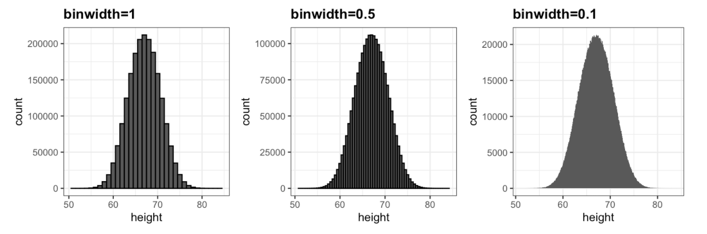

# Visualizando distribuições de dados

Os dados numéricos são frequentemente resumidos com o valor da média. Vamos pegar como exemplo, uma escola secundária tendo sua qualidade resumida em um único número, a pontuação média em um teste padronizado. As vezes temos dois números, sendo o segundo o desvio padrão, por exemplo um relatório afirmando que as pontuações foram 680 mais ou menos 50.

O primeiro componente básico de visualização de dados que aprenderemos será como resumir listas de fatores ou vetores de números. O resumo estatístico mais básico de uma lista de objetos ou números é sua distribuição. Para demonstrar como usaremos essas técnicas vamos usar como estudo de caso uma base de dados com altura de alunos.

## Tipos de variáveis
Com esse estudo de caso vamos usar dois tipos de váriaveis, a categórica e a numérica, sendo que cada uma pode ser dividida em outros dois grupos:
- Categóricas: quando a entrada em um vetor vem de um pequeno número de grupos
    - Ordinais: Um exemplo de categórico ordinal seria "Quanto tempo você gasta no celular?" "Pouco/Médio/Muito"
    - Não Ordinais: Um exemplo prático de não ordinal seria "Qual o sexo do bebê?" "Masculino/Feminino"
- Numéricas
    - Discretas: Variáveis discretas são aquelas em que os números nunca são decimais, por exemplo "Qual a sua idade?" "24/30/55/..."
    - Contínuas: Já as variáveis contínuas são aquelas que podem possuir decimais em sua resposta, por exemplo "Qual o valor total?" "R$ 10,50/R$ 99,99/R$ 2,80..."

Um datelhe é que dados numéricos discretos podem ser considerados ordinais, entretanto reservamos o termo dados ordinais para variáveis que pertencem a um pequeno número de grupos diferentes. Por exemplo, o número de maços de cigarro que uma pessoa fuma por dia, arredondado para o maço mais próximo, seria considerado ordinal pois um pequeno grupo de pessoas se encaixaria nesse número, enquanto o número real de cigarros seria considerado uma variável numérica.

## Estudo de caso: descrevendo a altura dos alunos
Imagine que precisamos descrever as alturas de alguns alunos para um ET, algo que nunca viu um ser humano antes. Para fazer isso vamos pedir para que os alunos indiquem suas alturas em polegadas e que nos fornecam seu sexo biológico. Feito isso vamos pegar esses dados e jogar em um *data frame* chamado ```heights```.

> Nesse caso já possuímos uma tabela com os dados fornecidos, para importá-la ao seu **RStudio** faça o seguinte:
```R
library(tidyverse)
library(dslabs)
data(heights)
```

Feito isso temos uma lista com 1.050 alturas de alunos distintos. Vamos tentar simplificar a visualização desses dados na lista nos concentrando em alturas masculinas e entendendo o conceito de distribuição.

## Função de distribuição
Em alguns casos, tudo o que precisamos para entender os dados são a média e o desvio padrão. Vamos ver técnicas que nos ajudem a determinar se o resumo desses dois números são ou não apropriados para obter uma resposta.

O resumo estatístico mais básico de uma lista de objetos ou números é sua distribuição. Podemos pensar na distribuição como a descrição compacta de uma lista com muitas entradas. Quando temos muitos dados categótricos, como o sexo biológico nesse caso, temos então a proporção de cada categoria. 

Quando há mais categorias, um gráfico de barras simples pode descrever a distribuição. Aqui está um exemplo de distribuição dos estados dos EUA por região:


Embora esse gráfico em particular não forneça muito mais informações do que uma tabela de frequência, ele é um excelente exemplo de como convertemos um vetor em um gráfico que resume todas as informações.

## Funções de distribuição acumulada
Em geral, quando os dados não são categóricos, a indicação da frequência de cada entrada não é um resumo efetivo, pois as entradas são únicas. Por exemplo, enquanto vários estudantes relataram uma altura de 68 polegadas, dois estudantes relataram alturas de 68.5 e 68.9 polegadas. Acreditamos que eles tenham convertido suas alturas para polegadas a partir dos valores 174 e 175 centímetros, respectivamente.

Quando temos casos assim usamos a função chamada **função de distribuição acumulada** (FDA), ela segue a seguinte notação:


Para exemplificar melhor essa fórmula, vamos usar como exemplo F(66) e F(72):


Quando aplicamos F(66) temos ocmo resultado que 16% dos valores são menores que 65, pois  
F(66)=0.164. Já quando aplicamos F(72) temos que 84% dos valores são menores que 72, pois  
F(72)=0.84. Com isso temos as informações de todos os nossos dados de maneira gráfica e resumida.

> Como os FDAs podem ser matematicamente definidos, a palavra empírico é adicionada para distinguir quando os dados são usados. Portanto, usamos o termo FDA empírico (FDAE).

## Histogramas
Apesar da existência da FDA, eles não são muito populares na prático, isso acontece porque ele não responde facilmente a algumas perguntas como "Em que valor a distribuição se concentra? A distribuição é simétrica? Quais intervalos contêm 95% dos valores?".

Quando trabalhamos com esses tipos de dados e queremos responder os variados tipos de perguntas como exemplificados acima, o mais comum é o uso do **histograma**. A maneira mais fácil de criar um histograma é dividir a distribuição dos nossos dados em compartimentos de mesmo tamanho que não se sobrepõem. Para cada compartimento, contamos o número de valores nesse intervalo.

O histograma representa graficamente essas contagens como barras em que a base é definida pelos intervalos. Observe abaixo um exemplo dos dados de altura separados em intervalos de polegadas [49.5,50.5],[51.5,52.5],(53.5,54.5],...,(82.5,83.5]:


O histograma é muito semelhante a um gráfico de barras, o que muda é seu eixo X, onde ao invés de categórico tem representação numérica.

Podemos rapidamente tirar deste gráfico alguams conclusões como:
- O intervalo de dados varia de 50 a 84, com a maioria entre 63 e 75 polegadas.
- As alturas são quase simétricas ficando em torno de 69 polegadas.

Claro que esse tipo de gráfico tem um lado negativo, neste caso o histograma não distingue entre 64, 64,1 e 64,2 polegadas, mas para nosso caso esse tipo de perda não é relevante a ponto de ser prejudicial.

## Curvas de densidade

Gráficos de curvas de densidade suavizadas (*smooth density*) são estéticamente mais agradáveis do que os histogramas. Eles não possuem extremidades afiadas e os picos são removidos, veja o exemplo abaixo:


Observe que a escala do eixo y mudou de contagens para densidade. Para entender esse gráfico é preciso ter conhecimento de **estimativas**. De maneira básica o que você precisa entender é que assumimos que nossa lista de valores observados é um subconjunto de uma lista muito maior de valores não observados.

Um exemplo que podemos aplicar para melhor compreensão é que nossa lista com 812 estudantes do sexo masculino tem, hipotéticamente, origem de uma lista muito maior que 1.000.000 de medidas. Essa lista de valores tem uma distribuição assim como qualquer outra lista. Dito isso, caso esses valores sejam medidos com muita precisão, poderíamos fazer um histograma com barras de compartimentos muito pequenas, o que possibilita a densidade suave.

Quanto menor o intervalo do compartimento das barras, mais suave o histograma se torna. Veja por exemplo histogramas com larguras de compartimento de 1, 0,5 e 0,1:



De qualquer maneira, esse exemplo hipotético não se aplica a nossa situação pois temos apenas 812 variáveis. Portanto vamos fazer um histograma apropriado a nossos dados e em seguida desenhamos uma curva sauve que passa pelo topo das barras do histograma, veja a seguir:


Devemos ficar atentos também ao termo *suave* pois ele é relativo, observe abaixo dois níveis de suavidade diferentes:


Essa diferença na vizualização pode alterar nossa interpretação dos dados. No nosso caso, realmente temos motivos para acreditar que a proporção de pessoas com alturas semelhantes deve ser a mesma. Isso implica que a curva deve ser razoavelmente suave; isto é, a curva deve se parecer mais com o exemplo à direita do que com a esquerda.

### Interpretando o eixo y
Para entender melhor o eixo y de um gráfico de densidade suave vamos usar está imagem como exemplo:


Se você imaginar que formamos um compartimento com uma base de 1 unidade de comprimento, o valor do eixo y indica a proporção de valores nesse compartimento. Por exemplo, no caso acima a proporção entre os valores de 65 e 68 polegadas é de 0.3, ou seja, aproximadamente 30% das alturas dos estudantes do sexo masculino estão entre 65 e 68 polegadas.

### Densidades permitem a estratificação
Uma vantagem das densidades suaves sobre os histogramas para propósitos de visualização é que as densidades facilitam a comparação entre duas distribuições, com o argumento correto, **ggplot** sombreia automaticamente a região de interseção com uma cor diferente. Veja o exemplo a seguir:


## Distribuição normal
A distribuição normal, também conhecida como curva de sino ou como distribuição Gaussiana, é um dos conceitos matemáticos mais famosos da história. Com ela conseguimos entender o motivo da média e o desvio padrão serem tão usados para o resumo estatístico.

A simetria da distribuição é baseada na média sendo que 95% dos valores esta dentro de 2 desvios padrão da média. Quando temos uma distribuição normal com média 0 e desvio padrão de 1, é assim que irá ser representado:


A distribuição ser definida por apenas dois parâmetros faz com que, se a distribuição de um conjunto de dados puder ser aproximada por uma distribuição normal, todas as informações necessárias para descrever a distribuição poderão ser codificadas pela média e o desvio padrão.

Vamos definir a média(**m**) e o desvio padrão(**s**) de uma lista arbitrária de números:
```R
m <- sum(x)/ length(x)
s <- sqrt(sum((x-mu)^2)/ length(x))
```

Vamos agora calcular os valores para alturas de homens que armazenaremos no objeto **x**:
```R
index <- heights$sex == "Male"
x <- heights$height[index]
```

Podemos também usar as funções ```mean```e ```sd``` para o calculo de média e desvio padrão:
```R
m <- mean(x)
s <- sd(x)
c(average = m, sd = s)
```

O gráfico de densidade suave que pode representar visualmente esses dados seria:


A distribuição normal com média = 69.3 e DP = 3.6 foi plotada como uma linha preta com a curva de densidade suave da altura dos alunos em azul.

## Unidades padrão
Quando temos dados aproximadamente com distribuição normal, o melhor seria pensar em termos de unidade padrão. A unidade padrão de um valor é o que nos diz a quantos desvios padrão da média ele está. Para calcular esse valor seguimos a fórmula ```z = (x - m)/s```, sendo **m** e **s** a média e desvio padrão de **X** que é o valor.

Se convertermos dados normalmente distribuídos em unidades padrão, poderemos saber rapidamente, por exemplo, se uma pessoa está na média (z=0) ,entre os maiores (z≈2), entre os menores (z≈−2) ou apresenta uma ocorrência extremamente rara (z>3  ou  z<−3).

Para obter as unidades padrão em R, usamos a função ```scale```:
```R
z <- scale(x)
```

Feito isso, podemos agora ver quantos homens estão dentro de 2 desvios padrão da média:
```R
mean(abs(z) < 2)
```

Como resposta temos que a proporção é de aproximadamente 95%. Se quisermos ter ainda mais confirmações disso podemos utilizar gráficos QQ (*quantile-quantile plots*).

## Gráficos QQ
Para avaliar melhor o quão bem a distribuição normal se ajusta aos dados, verificamos se as proporções observadas e previstas correspondem. Para isso usamos o gráfico quantil-quantil ou também chamado **gráfico QQ**.

Para definir os quantis teóricos para a distribuição normal, geralmente usamos o Φ(Fi). Ele nos dá a probabilidade de que uma distribuição normal padrão seja menor que **x**. Por exemplo, Φ(−1.96)=0.025  e Φ(1.6)=0.975. Em R avaliamos o Φ usando a função ```pnorm```, já para a função inversa usamos a função ```qnorm```:
```R
pnorm(-1.96)
# Resulta 0.025
qnorm(0.975)
# Resulta 1.96
```
 
Esses cálculos são para a distribuição normal padrão (média = 0, desvio padrão = 1), mas também podemos defini-los para qualquer distribuição normal. Podemos fazer isso usando os argumentos ```mean``` e ```sd``` nas funções ```pnorm``` e ```qnorm```. Por exemplo, podemos usar ```qnorm``` para determinar quantis de uma distribuição com média e desvio padrão específicos:
```R
qnorm(0.975, mean = 5, sd = 2)
# Resulta 8.92
```

Se tivermos dados em um vetor **x**, podemos definir o quantil associado a qualquer proporção **p**, assim como o **q** para os quais a proporção de valores abaixo de **q** é **p**. Usando o R, podemos definir **q** como um valor pelo qual ```mean(x <= q) = p```. Como um exemplo rápido, para dados de altura masculina, vemos que:
```R
mean(x <= 69.5)
# Resulta 0.515
```

Ou seja, cerca de 50% são menores ou iguais a 69 polegadas. Isso implica que se **p=0.50**, então **q=69.5**.

O objetivo de um **gráfico QQ** é que se seus dados forem bem aproximados pela distribuição normal, os quantis de seus dados deverão ser semelhantes aos quantis de uma distribuição normal. Para criação de um **gráfico QQ** fazemos o seguinte:
- Definimos um vetor de **m** dimensões: **p1, p2, ..., pm**
- Definimos um vetor de quantis **q1, ..., qm** para as proporções **p1, ..., pm** usando seus dados. Nos referimos a eles como *quantis de amostra*.
- Definimos um vetor de *quantis teóricos* para as proporções **p1, ..., pm** para uma distribuição normal com a mesma média e desvio padrão dos dados.
- Plotamos os quantis da amostra versus os quantis teóricos.

Vamos plotar um como exemplo, primeiro vamos criar o vetor de proporções:
```R
p <- seq(0.05, 0.95, 0.05)
```
Para obter os quantis dos dados(quantil de amostra), usamos a função ```quantile```:
```R
sample_quantiles <- quantile(x, p)
```
Agora vamos obter os quantis teóricos da distribuição normal com a média e o desvio padrão correspondentes, usamos a função ```qnorm```:
```R
theoretical_quantiles <- qnorm(p, mean = mean(x), sd = sd(x))
```
Por fim plotamos um contra o outro, e verificamos se correspondem ou não. Podemos também desenhar uma linha de identidade:
```R
qplot(theoretical_quantiles, sample_quantiles) + geom_abline()
```

Esse código seria muito mais limpo se tivessimos usado unidades padrão:
```R
sample_quantiles <- quantile(z, p)
theoretical_quantiles <- qnorm(p)
qplot(theoretical_quantiles, sample_quantiles) + geom_abline()
```

De qualquer maneira, na prática do dia a dia, o mais fácil é usar as funçoes do **ggplot2**:
```R
heights %>% filter(sex == "Male") %>%
ggplot(aes(sample = scale(height))) +
geom_qq() +
geom_abline()
```

## Percentis
Esse é um termo muito comum usado na análise exploratória de dados. Percentis (**p**) são formas de quantis usados com muita frequência no dia a dia, por exemplo o p = 0.25 é chamado de 25º percentil, pois fornece um número para o qual 25% dos dados estão abaixo. O percentil mais famoso é 50º, também conhecido como mediana.

Outro caso especial que recebe um nome são os quartis, obtidos através da configuração **p=0.25, 0.50 e 0.75**.

## Diagramas de caixas (boxplots)
Para explicar melhor os **boxplots** vamos usar de novo os dados de assassinatos nos EUA. Vamos sumarizar a distribuição da taxa de homicídios, se usarmos as técnicas de visualização de dados que aprendemos anteriormente, podemos ver que a aproximação normal não se aplica aqui:


Vamos então supor que aqueles que estão acostumados a receber apenas dois números como resumos solicitem uma sumarização numérica mais compacta. Para isso vamos usar o *boxplot*, ele trabalha com 5 números compostos pelo: intervalo, quartis (percentis 25, 50 e 75). Caso existam *outliers* (números muito fora do intervalo), vamos tratá-los como pontos independentes. Trabalhando com os dados dessa maneira podemos ter uma visualização como esta:


Nessa caixa temos uma caixa que é definida pelos percentis de 25% e 75% e com uma linha central mostrando o intervalo. A distância entre esses dois é chamada de *interquartil*. Podemos ver também os pontos discrepantes do intervalos (*outliers*) sendo representados. Já a linha horizontal dentro da caixa representa a mediana (percentil 50%).

A partir desse simples gráfico, sabemos que a mediana é de aproximadamente 2,5, que a distribuição não é simétrica e que o intervalo varia de 0 a 5 para a grande maioria dos estados, com duas exceções.

## Estratificação
A estratificação é comum na visualização de dados, pois geralmente estamos interessados em saber como a distribuição de variáveis difere entre diferentes subgrupos. Por exemplo, em nosso caso de estudo , dividiremos os valores de altura em grupos de acordo com uma variável de gênero: mulheres e homens. Chamamos esse procedimento de **estratificação**.

## Estudo de caso: descrevendo as alturas dos alunos (continuação)
Usando histogramas, gráficos de densidade e gráficos QQ, ficamos convencidos de que os dados de altura masculina se aproximam muito de uma distribuição normal. Mas agora precisamos também apresentar esses dados de maneira mais geral, ou seja, também devemos fornecer um resumo das alturas femininas.

Vamos usar então os boxplots para que possamos comprar rapidamente duas ou mais distribuições:


Podemos rapidamente ver que os homens são, em média, mais altos que as mulheres. Além disso, os desvios padrão parecem ser semelhantes. Porém dando uma olhada em outros gráficos (o de densidade e o gráfico QQ) percebemos que o gráfico de densidade tem uma segunda "protuberância".Além disso, o gráfico QQ mostra que os pontos mais altos tendem a ser maiores do que o esperado pela distribuição normal. 


 Também vemos cinco pontos no gráfico QQ que sugerem alturas inferiores às esperadas para uma distribuição normal. Mas se olharmos para outros conjuntos de dados de distribuição de alturas femininas, podemos descobrir que elas são bem aproximadas com uma distribuição normal. Sendo assim, a visualização de dados ajudou a descobrir uma possível falha em nossos dados. Vamos dar uma olhada nos dados discrepantes:
 ```R
 heights %>% filter(sex == "Female") %>%
top_n(5, desc(height)) %>%
pull(height)
# Resposta 51 53 55 52 52
 ```

 Como essas as alturas são inseridas pelos próprios alunos, há uma possibilidade que eles desejavam dizer na verdade 5'1", 5'2", 5'3" ou 5'5"?

 ## Geometrias ggplot2
 Vamos ver agora de maneira detalhada como gerar gráficos relacionados a distribuições, especificamente os gráficos mostrados anteriormente.

 ### Gráficos de barra
 Para gerar um gráfico de barras (barplot em inglês), podemos usar a geometria ```geom_bar```. Por padrão, R conta o número de ocorrências em cada categoria e desenha uma barra. No exmeplo abaixo temos o gráfico de barras para as regiões dos Estados Unidos:
 ```R
 ggplot(murders, aes(region)) + geom_bar()

 # OU

 murders %>% ggplot(aes(region)) + geom_bar()
 ```


Mas e se quisermos que o ```geom_bar``` represente graficamente uma barra de proporções no eixo y? Para isso vamos primeiro criar uma tabela separada por região e seus valores proporcionais, logo depois vamos plotar um novo gráfico usando os dados de proporção obtidos como eixo y:
```R
# Criando tabela de proporção
tab <- murders %>%
  count(region) %>%
  mutate(proportion = n/sum(n)

# Criando novo gráfico com eixo y alterado
tab %>% ggplot(aes(region, proportion)) + geom_bar(stat = "identity")
```


### Histogramas
Para gerar histogramas, podemos utilizar a função ```geom_histogram```, o único argumento necessário é **x**, a variável para a qual construiremos um histograma. O código será assim:
```R
heights %>%
filter(sex == "Female") %>%
ggplot(aes(height)) +
geom_histogram()
```

Caso seja necessário podemos alterar o tamanho de compartimento do histograma, vamos aplicar tamanho 1 como anteriormente:
```R
heights %>%
filter(sex == "Female") %>%
ggplot(aes(height)) +
geom_histogram(binwidth = 1)
```

Por fim, se por razões estéticas quisermos adicionar cores, rótulos e títulos também é viável:
```R
heights %>%
filter(sex == "Female") %>%
ggplot(aes(height)) +
geom_histogram(binwidth = 1, fill = "blue", col = "black") +
xlab("Altura feminina em polegadas") +
ggtitle("Histograma")
```


### Gráficos de densidade
Para criar um gráfico de densidade suave, usamos ```geom_density```, para fazer um gráfico de densidade suave com os dados que visualizamos anteriormente como um histograma, podemos usar este código:
```R
heights %>%
filter(sex == "Female") %>%
ggplot(aes(height)) +
geom_density()
```

Se quisermos adicionar cores usamos o argumento ```fill``` e para alterar a suavidade da densidade, usamos o argumento adjust para multiplicar o valor padrão pelo ajuste. Por exemplo, se queremos que o parâmetro de suavização seja duas vezes maior, usamos:
```R
heights %>%
filter(sex == "Female") %>%
ggplot(aes(height)) +
geom_density(fill="blue", adjust = 2)
```


### Boxplots
A  geometria para a criação de gráficos de caixas é a ```geom_boxplot```, eles são úteis para comparar distribuições. Por exemplo, abaixo vemos as alturas mostradas anteriormente para as mulheres comparadas às alturas dos homens. Para essa geometria, precisamos dos argumentos ```x```e ```y``` com os valores:


### Gráficos QQ
Para gráficos QQ, usamos a geometria ```geom_qq```, aqui precisamos especificar o *sample*. Veja como exemplo o gráfico QQ para as alturas masculinas:
```R
heights %>% filter(sex=="Male") %>%
ggplot(aes(sample = height)) +
geom_qq()
```


Por padrão, a variável de amostra é comparada a uma distribuição normal com uma média de 0 e um desvio padrão de 1. Para alterar isso, usamos o argumento ```dparams```. Para adicionar uma linha de identidade, basta atribuir uma outra camada. Para linhas retas, usamos a função ```geom_abline```:
```R
params <- heights %>% filter(sex=="Male") %>%
summarize(mean = mean(height), sd = sd(height))

heights %>% filter(sex=="Male") %>%
ggplot(aes(sample = height)) +
geom_qq(dparams = params) +
geom_abline()
```

Podemos também dimensionar os dados primeiro e, em seguida, plotar o QQplot contra a distribuição normal padrão:
```R
heights %>%
filter(sex=="Male") %>%
ggplot(aes(sample = scale(height))) +
geom_qq() +
geom_abline()
```

### Imagens
As vezes ao trabalhar com o R precisamos adicionar imagens no nosso código, par aisso temos duas geometrias usadas para criar imagens: ```geom_tile``` e ```geom_raster```. Para criar uma imagem em ggplot2, precisamos de um data frame com as coordenadas x e y, além dos valores associados a cada uma delas. Aqui temos um data frame:
```R
x <- expand.grid(x = 1:12, y = 1:10) %>%
mutate(z = 1:120)
```

Note que esta é a versão organizada de uma matriz, para representar graficamente a imagem, usamos o seguinte código:
```R
x %>% ggplot(aes(x, y, fill = z)) +
geom_raster()
```

Para essas imagens, geralmente é necessário alterar a escala de cores. Isso pode ser feito através da camada ```scale_fill_gradientn```:
```R
x %>% ggplot(aes(x, y, fill = z)) +
geom_raster() +
scale_fill_gradientn(colors = terrain.colors(10))
```


### Gráficos rápidos